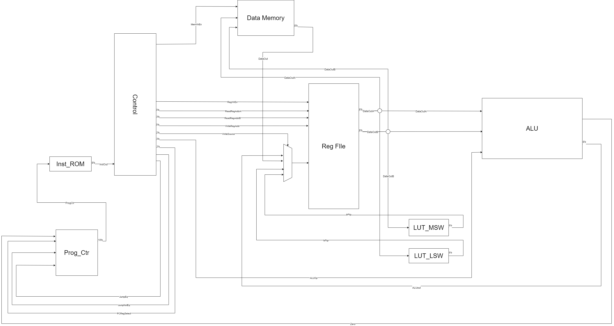

**0. Team**
- Nataly Buhr
- Joshua Kuschner
- Cherellen Banaga

**1. Introduction**
- Name: Processor Go Brr
- Our processor is, for the most part, a reg-reg machine. For some instructions, register 8 serves as an accumulator type register for the purpose of trimming down instruction length such that they all fit within the 9-bit limit.

**2. Architectural Overview**

**3. Machine spec**
### Instruction Format:
1. load                     `ld  [dest_reg]`
   1. Always loads from the address at r1 into `dest_reg`.
2. store                    `str [source_reg] [dest_addr]`
   1. Always stores into the the address at r1 from `dest_reg`.
3. logical shift left       `lsl [dest_reg] [src_reg]`
   1. Shifts in 0's to destination
   2. `dest_reg` and `src_reg` can be any reg 1-8
   4. Shift amount is always grabbed from `r8`
4. logical shift right      `lsr [dest_reg] [src_reg] shamt`
   1. Shifts in 0's to destination
   2. `dest_reg` and `src_reg` can be any reg 1-8
   4. Shift amount is always grabbed from `r8`
5. bitwise or               `or  [dest_reg] [other_reg]`
   1. Bitwise or `dest_reg` w/ `other_reg` and store in `dest_reg`
   2. `dest_reg` can be any reg
   3. `other_reg` can be `r[4-7]`
6. bitwise xor              `xor [dest_reg]`
   1. Bitwise xor `dest_reg` and the reg number store in `r8` and store in `dest_reg`
7. reduction xor            `rxr [dest_reg]`
8. add                      `add [dest_reg] [0 or 1]`
   1. use 0 to indicate regular addition or 1 for subtraction (adding a negative)
   2. adds the number in register 8 with the value in `dest_reg` and stores the result in `dest_reg`
9.  move immediate           `mov immi5`
   2.  Always moves into `r8`
10. jump if equal           `je  [1 or 2 or 3]`
    1.  jumps to the address stored into one of the 3 dedicated saved PC reg
11. jump not equal          `jne [1 or 2 or 3]`
    1.  jumps to the address stored into one of the 3 dedicated saved PC reg
12. store PC                `spc [1 or 2 or 3] offset`
    1.  if `offset == 0` stores current address into one of 3 dedicated saved PC reg
    2.  otherwise, check `r8` for the relative offset amount
13. Lookup Table            `lut [input_reg] [1 or 2]`
14. Counter clear           `ctc [a | b | c | b_flag]`
15. Counter increment       `cti [a | b | c | b_flag]`
16. Counter store           `cts [a | b | c | b_flag]`
17. B_flag condition set    `cbf` // sets the zero/
18. single substring         `sbs [dest_reg]`
    1. stores 5-bit subtring from `r5` into top 5 bits of `dest_reg` based on value of `r3` to determine which 5-bit substring to grab 
19. double substring        `dbs [dest_reg]`
    1.  stores 5-bit subtring that spans across `r5` and `r6` into top 5 bits of `dest_reg` based on value of `r3` to determine which 5-bit substring to grab
20. Copy reg                `cpy [dest_reg]`
    1.  Copies value of `r8` into `[dest_reg]`

### Instruction OpCodes and Format
1. ld       `[5'b 01000 | 3'b reg encode | 1'b unused]`
2. str      `[5'b 01001 | 3'b reg encode | 1'b unused]`
3. lsl      `[3'b 000 | 3'b reg encode | 3'b reg encode]`
4. lsr      `[3'b 001 | 3'b reg encode | 3'b reg encode]`
5. or       `[4'b 1101 | 3'b reg encode | 2'b reg encode]`
6. xor      `[4'b 0110 | 3'b reg encode | 2'b unused]`
7. rxr      `[4'b 0111 | 3'b reg encode | 2'b unused]`
8. add      `[4'b 1110 | 3'b reg encode | 1'b choice| 1'b unused]`
9. mov      `[4'b 1111 | immi5]`
10. je      `[5'b 10000 | 3'b choice | 1'b unused]`
10. jne     `[5'b 10001 | 3'b choice | 1'b unused]`
11. spc     `[4'b 1001 | 2'b reg choice | offset1 | 2'b unused]`
12. lut     `[4'b 1010 | 3'b reg encode | 1'b choice | 1'b unused]`
13. ctc     `[4'b 1011 | 2'b ctr op | 2'b reg choice | 1'b unused]`
13. cti     `[4'b 1011 | 2'b ctr op | 2'b reg choice | 1'b unused]`
13. cts     `[4'b 1011 | 2'b ctr op | 2'b reg choice | 1'b unused]`
13. cbf     `[4'b 1011 | 2'b ctr op | 3'b unused]`
14. sbs     `[5'b 01010 | 3'b reg encode | 1'b unused]`
15. dbs     `[5'b 01011 | 3'b reg encode | 1'b unused]`
16. cpy     `[4'b 1100 | 3'b reg encode | 2'b unused]`

### Internal Operands
- 16 registers are supported: 8 are for general purpose, 8 for dedicated usage (e.g. program counters)

### Branches
- Two jump instructions, for equal and unequal comparison, are supported.
- As noted in the instruction syntax, these are designed to jump specifically to the address stored in one of the dedicated PC registers.
- Such addresses can be calculated by calling spc and storing the current in a selected PC register if the offset field is set to 0
   - If the offset != 0, use r8's stored value for the offset amount

### Addressing
| Mode              | Example     |
| -------------             | -------------     |
| Immediate mode         | `mov #1`     |
| Implied addressing mode      | `cbf`          |
| Indirect addressing mode      | `str r2, [r1]`    |
| Register addressing mode      | `xor r4, r1`    |

**4. Programmer's Model**

Programmers who use our machine should keep the following in mind:

- No assumptions should be made about register values at the start of any program. For example, if '0' is a desired default value then the programmer will have to manually load that value into all registers at the start.
- Our ISA is implemented as a combination of the classic accumulator and reg-reg designs. While many of our instructions might seem familiar, their implementation may be different from what one might expect, so we highly recommend reading through our instructions to understand what operations are possible, what information is needed to carry them out, and any implicit decisions that might be made behind the scenes.
  - An example of a tricky instruction is `lut`, which was specifically made to assist in single-bit error correction for our program 2. `lut` is meant to take in the result of comparing two strings of parity bits. It returns a string that contains at most one '1' that is then meant to be xor'ed with a corresponding string of data bits to flip an incorrect bit, if the result of the parity comparison indicated. Programmers who want to make use of this instruction need to understand how this it works in conjunction with others to produce the desired result.
- Register 8 is an implicit destination register for many of our instructions; as such, important data generally shouldn't be kept in this register as it can easily be overwritten.
- Registers 9-16 are hidden/dedicated registers that aren't meant to be accessed outside of very specific instructions -- the programmer shouldn't try to change the values of the registers outside of the provided instructions that already do so, or their ability to correctly execute loops, if/else statements, etc. could be compromised.

An example of an assembly language instruction in our machine and its machine code translation:

- Assembly:     mov #20
- Machine code: 111110100

(This would result in the number 20 being stored in register 8.)
