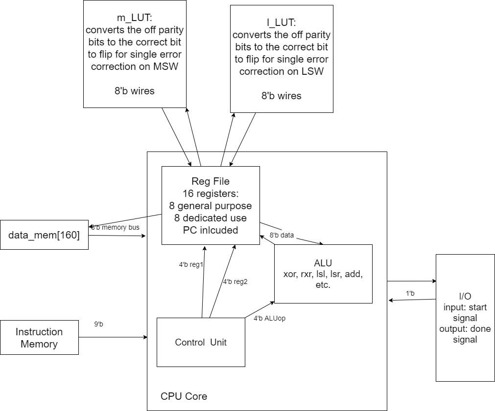

**0. Team**
- Nataly Buhr
- Joshua Kuschner
- Cherellen Banaga

**1. Introduction**
- Name: Processor Go Brr
- Our processor is, for the most part, a reg-reg machine. For some instructions, register 8 serves as an accumulator type register for the purpose of trimming down instruction length such that they all fit within the 9-bit limit.

**2. Architectural Overview**


**3. Machine spec**
### Instruction Format:
1. load                     `ld  [dest_reg]`
   1. Always loads from the address at r1 into `dest_reg`.
2. store                    `str [source_reg] [dest_addr]`
   1. Always stores into the the address at r1 from `dest_reg`.
3. logical shift left       `lsl [dest_reg] [src_reg]`
   1. Shifts in 0's to destination
   2. `dest_reg` and `src_reg` can be any reg 1-8
   4. Shift amount is always grabbed from `r8`
4. logical shift right      `lsr [dest_reg] [src_reg] shamt`
   1. Shifts in 0's to destination
   2. `dest_reg` and `src_reg` can be any reg 1-8
   4. Shift amount is always grabbed from `r8`
5. bitwise or               `or  [dest_reg] [other_reg]`
   1. Bitwise or `dest_reg` w/ `other_reg` and store in `dest_reg`
   2. `dest_reg` can be any reg
   3. `other_reg` can be `r[4-7]`
6. bitwise xor              `xor [dest_reg]`
   1. Bitwise xor `dest_reg` and the reg number store in `r8` and store in `dest_reg`
7. reduction xor            `rxr [dest_reg]`
8. add                      `add [dest_reg] [0 or 1]`
   1. use 0 to indicate regular addition or 1 for subtraction (adding a negative)
   2. adds the number in register 8 with the value in `dest_reg` and stores the result in `dest_reg`
9.  move immediate           `mov immi5`
   2.  Always moves into `r8`
10. jump if equal           `je  [1 or 2 or 3]`
    1.  jumps to the address stored into one of the 3 dedicated saved PC reg
11. jump not equal          `jne [1 or 2 or 3]`
    1.  jumps to the address stored into one of the 3 dedicated saved PC reg
12. store PC                `spc [1 or 2 or 3] offset`
    1.  if `offset == 0` stores current address into one of 3 dedicated saved PC reg
    2.  otherwise, check `r8` for the relative offset amount
13. Lookup Table            `lut [input_reg] [1 or 2]`
14. Counter clear           `ctc [a | b | c | b_flag]`
15. Counter increment       `cti [a | b | c | b_flag]`
   1. Make sure to `r8` contains a decimal 1 before using this instruction.
16. Counter store           `cts [a | b | c | b_flag]`
17. B_flag condition set    `cbf` // sets the zero/
18. single substring         `sbs [dest_reg]`
    1. stores 5-bit subtring from `r5` into top 5 bits of `dest_reg` based on value of `r3` to determine which 5-bit substring to grab 
19. double substring        `dbs [dest_reg]`
    1.  stores 5-bit subtring that spans across `r5` and `r6` into top 5 bits of `dest_reg` based on value of `r3` to determine which 5-bit substring to grab
20. Copy reg                `cpy [dest_reg]`
    1.  Copies value of `r8` into `[dest_reg]`

### Instruction OpCodes and Format
1. ld       `[5'b 01000 | 3'b reg encode | 1'b unused]`
2. str      `[5'b 01001 | 3'b reg encode | 1'b unused]`
3. lsl      `[3'b 000 | 3'b reg encode | 3'b reg encode]`
4. lsr      `[3'b 001 | 3'b reg encode | 3'b reg encode]`
5. or       `[4'b 1101 | 3'b reg encode | 2'b reg encode]`
6. xor      `[4'b 0110 | 3'b reg encode | 2'b unused]`
7. rxr      `[4'b 0111 | 3'b reg encode | 2'b unused]`
8. add      `[4'b 1110 | 3'b reg encode | 1'b choice| 1'b unused]`
9. mov      `[4'b 1111 | immi5]`
10. je      `[5'b 10000 | 2'b choice | 2'b unused]`
10. jne     `[5'b 10001 | 2'b choice | 2'b unused]`
11. spc     `[4'b 1001 | 2'b reg choice | offset1 | 2'b unused]`
12. lut     `[4'b 1010 | 3'b reg encode | 1'b choice | 1'b unused]`
13. ctc     `[4'b 1011 | 2'b ctr op | 2'b reg choice | 1'b unused]`
13. cti     `[4'b 1011 | 2'b ctr op | 2'b reg choice | 1'b unused]`
13. cts     `[4'b 1011 | 2'b ctr op | 2'b reg choice | 1'b unused]`
13. cbf     `[4'b 1011 | 2'b ctr op | 3'b unused]`
14. sbs     `[5'b 01010 | 3'b reg encode | 1'b unused]`
15. dbs     `[5'b 01011 | 3'b reg encode | 1'b unused]`
16. cpy     `[4'b 1100 | 3'b reg encode | 2'b unused]`

**Note**: Our decoder is able to support variable length opcodes because each of the shorter opcodes are chosen such they they are never the same as the first sequence of bits in a longer opcode. Therefore, the decoder is able to differentiate between instructions with different opocode lengths by checking the first bits for the shorter patterns and then checking subsequent bits if those patterns are not found.

#### Changelog
- 2022/02/08 - Added note on variable length opcodes

### Internal Operands
- 16 registers are supported: 8 are for general purpose, 8 for dedicated usage (e.g. program counters)
- r0 is dedicated 0 register
- r1 is dedicated for to hold addresses for memory ops
- r2-r7 are general purpose
- r8 is accumulator used for several instructions
- r9 holds a counter
- r10 holds b counter
- r11 holds c counter
- r12 holds b_flag
- r13 holds 192 (mem addr for storing a count)
- r14 holds 193 (mem addr for storing b count)
- r15 holds 194 (mem addr for storing c count)

### Branches
- Two jump instructions, for equal and unequal comparison, are supported.
- As noted in the instruction syntax, these are designed to jump specifically to the address stored in one of the dedicated PC registers.
- Such addresses can be calculated by calling spc and storing the current in a selected PC register if the offset field is set to 0
   - If the offset != 0, use r8's stored value for the offset amount

### Addressing
| Mode                          | Address Calculation | Example     |
| -------------                 |------------- | -------------     |
| Immediate mode                | N/A | `mov  #1`     |
| Implied addressing mode       | Effective address is implied in opcode | `cbf`  |
| Indirect addressing mode        | Effective address contained in base register | `str r2, [r1]`    |
| Register direct addressing mode      | N/A | `xor r4, r1`    |

All addressing done by this processor is direct. When a load or store instruciton is run, the memory address would always be taken from register 1. 

##### Load
`ld r2`
This will load the data located in `data_mem[r1]` into the `r2` register.

##### Store
`str r2`
This will store the data in the `r2` register in `data_mem[r1]`.

#### Changelog


**4. Programmer's Model**

Programmers who use our machine should keep the following in mind:

- No assumptions should be made about register values at the start of any program. For example, if '0' is a desired default value then the programmer will have to manually load that value into all registers at the start.
- Our ISA is implemented as a combination of the classic accumulator and reg-reg designs. While many of our instructions might seem familiar, their implementation may be different from what one might expect, so we highly recommend reading through our instructions to understand what operations are possible, what information is needed to carry them out, and any implicit decisions that might be made behind the scenes.
  - An example of a tricky instruction is `lut`, which was specifically made to assist in single-bit error correction for our program 2. `lut` is meant to take in the result of comparing two strings of parity bits. It returns a string that contains at most one '1' that is then meant to be xor'ed with a corresponding string of data bits to flip an incorrect bit, if the result of the parity comparison indicated. Programmers who want to make use of this instruction need to understand how this it works in conjunction with others to produce the desired result.
- Register 8 is an implicit destination register for many of our instructions; as such, important data generally shouldn't be kept in this register as it can easily be overwritten.
- Registers 9-16 are hidden/dedicated registers that aren't meant to be accessed outside of very specific instructions -- the programmer shouldn't try to change the values of the registers outside of the provided instructions that already do so, or their ability to correctly execute loops, if/else statements, etc. could be compromised.

An example of an assembly language instruction in our machine and its machine code translation:

- Assembly:     mov #20
- Machine code: 111110100

(This would result in the number 20 being stored in register 8.)

### Program 1
```
spc #1, #0         // save PC to PCreg1
mov #0             // move 0 into r8 (to copy into r1)
cpy r1             // set r1(i) to 0
ld  r2, [r1]       // load LSW from data_mem[i]
mov #1             // mov 1 into r8 (for upcoming add)
add r1, 0          // add 1 to i
ld  r3, [r1]       // load MSW from data_mem[i+1]
mov #4             // move 4 into r8 (for use in upcoming lsr)
lsr r4, r2         // right shift LSW into tLSW
mov #4             // move 4 into r8 (for use in upcoming lsl)
lsl r5, r3         // left shift MSW into tMSW
or  r5, r4         // store tLSW in tmp
rxr r5             // store p8 in r5
mov #4             // move 4 into r8 (for use in upcoming lsl)
lsl r5, r5         // put p8 in correct position
or  r6, r5         // store p8 in parity reg

mov #4             // move 4 into r8 (for use in upcoming lsl)
lsl r5, r3         // left shift MSW into tMSW
mov #7             // move 7 into r8 (for use in upcoming lsr)
lsr r4, r2         // right shift LSW into tLSW
mov #3             // move 3 into r8 (for use in upcoming lsl)
lsl r4, r4         // reposition b8
or  r5, r4         // put b11:b8 into tMSW
mov #4             // move 4 into r8 (for use in upcoming lsl)
lsl r4, r2         // left shift LSW into tLSW
mov #5             // move 5 into r8 (for use in upcoming lsr)
lsr r4, r4         // reposition b4:b2
or  r5, r4         // puts 0_b11:b8_b4_b3_b2 into tRSW
rxr r5             // store p4 in r5
mov #3             // move 3 into r8 (for use in upcoming lsl)
lsl r5, r5         // put p4 in correct position
or  r6, r5         // store p4 in parity reg

mov #1             // move 1 into r8 (for use in upcoming lsr)
lsr r5, r3         //tMSW = 0000_00_b11:b10
mov #5             // move 5 into r8 (for use in upcoming lsl)
lsl r5, r5         //tMSW = 0_b11:b10_0_0000
mov #1             // move 1 into r8 (for use in upcoming lsl)
lsl r4, r2         //tLSW = b7:b6_XX_XXX0
mov #6             // move 6 into r8 (for use in upcoming lsr)
lsr r4, r4         //tLSW = 0000_00_b7:b6
mov #3             // move 3 into r8 (for use in upcoming lsl)
lsl r4, r4         //tLSW = 000_b7:b6_000
or  r5, r4         //tMSW = 0_b11:b10_b7:b6_000
mov #2             // move 2 into r8 (for use in upcoming lsr)
lsr r4, r2         //tLSW = 00XX_00_b4:b3
mov #6             // move 6 into r8 (for use in upcoming lsl)
lsl r4, r4         //tLSW = b4:b3_00_0000
mov #5             // move 5 into r8 (for use in upcoming lsr)
lsr r4, r4         //tLSW = 0000_0_b4:b3_0
or  r5, r4         //tMSW = 0_b11:b10_b7:b6_b4:b3_0
mov #7             // move 7 into r8 (for use in upcoming lsr)
lsr r4, r2         //tLSW = b1_000_0000
mov #7             // move 7 into r8 (for use in upcoming lsr)
lsr r4, r4         //tLSW = 0000_000b1
or  r5, r4         //tMSW = 0_b11:b10_b7:b6_b4:b3_b1
rxr r5             //store p2 in r5
mov #2             // move 2 into r8 (for use in upcoming lsl)
lsl r5, r5         //put p2 in correct position
or  r6, r5         //store p2 in parity reg

mov #2             // move 2 into r8 (for use in upcoming lsr)
lsr r5, r3         //tMSW = 0000_000b11
mov #6             // move 6 into r8 (for use in upcoming lsl)
lsl r5, r5         //tMSW = 0b11_00_0000
mov #7             // move 7 into r8 (for use in upcoming lsl)
lsl r4, r3         //r4 = b9_000_0000
mov #2             // move 2 into r8 (for use in upcoming lsr)
lsr r4, r4         //r4 = 00_b9_0_0000
or  r5, r4         //r5 = 0_b11_b9_0_0000
mov #6             // move 6 into r8 (for use in upcoming lsr)
lsr r4, r2         //r4 = 0000_00Xb7
mov #7             // move 7 into r8 (for use in upcoming lsl)
lsl r4, r4         //r4 = b7_000_0000
mov #3             // move 3 into r8 (for use in upcoming lsr)
lsr r4, r4         //r4 = 000_b7_0000
or  r5, r4         //r5 = 0_b11_b9_b7_0000
mov #3             // move 3 into r8 (for use in upcoming lsr)
lsr r4, r2         //r4 = 000X_XXb5:b4
mov #6             // move 6 into r8 (for use in upcoming lsl)
lsl r4, r4         //r4 = b5:b4_00_0000
mov #4             // move 4 into r8 (for use in upcoming lsr)
lsr r4, r4, #4     //r4 = 0000_b5:b4_00
or  r5, r4         //r5 = 0_b11_b9_b7_b5_b4_00
mov #6             // move 6 into r8 (for use in upcoming lsl)
lsl r4, r2         //r4 = b2:b1_00_0000
mov #6             // move 6 into r8 (for use in upcoming lsr)
lsr r4, r4         //r4 = 0000_00b2:b1
or  r5, r4         //r5 = 0_b11_b9_b7_b5_b4_b2_b1
rxr r5             //save p1 in r5
mov #1             // move 1 into r8 (for use in upcoming lsr)
lsl r5, r5         //put p1 in correct position
or  r6, r5         // store p1 in parity reg

mov #0             // move 0 into r8 (for use in upcoming lsl)
lsl r4, r2         // copy LSW into r4
rxr r4             // rxr LSW
mov #0             // move 0 into r8 (for use in upcoming lsl)
lsl r5, r3         // copy MSW into r5
rxr r5             // rxr MSW
mov #7             // move 7 into r8 (for use in upcoming lsl)
lsl r5, r5         // make room for parity
or  r5, r6         // copy parities into r5
rxr r5             // rxr MSW+parities
mov #1             // move 1 into r8 (for use in upcoming lsl)
lsl r5, r5         // make room for rxr LSW
or  r5, r4         // copy rxr LSW into r5
rxr r5             // put p16 into r5
or  r6, r5         // store p16 in parity reg

mov #5             // move 5 into r8 (for use in upcoming lsl)
lsl r5, r3         // r5 = b11:b9_0_0000
mov #4             // move 4 into r8 (for use in upcoming lsr)
lsr r4, r2         // r4 = 0000_b8:b5
mov #1             // move 1 into r8 (for use in upcoming lsl)
lsl r4, r4         // r4 = 000_b8:b5_0
or  r5, r4         // r5 = b11:b5:0
mov #4             // move 4 into r8 (for use in upcoming lsr)
lsr r4, r6         // r4 = 0000_000p8
or  r5, r4         // r5 = b11:b5_p8
mov #29            // mov 29 into r8 (for upcoming add)
add r1, 0          //  set i to correct addr(i+30)
str r5, [r1]       // store r5 into data_mem[i+30]
mov #1             // move 1 into r8 (for use in upcoming lsr)
lsr r4, r2         // r4 = 0000_0b4:b2
mov #5             // move 5 into r8 (for use in upcoming lsl)
lsl r4, r4         // r4 = b4:b2_0_0000
mov #4             // move 4 into r8 (for use in upcoming lsl)
lsl r5, r6         // r5 = p4_XXX_0000
mov #7             // move 7 into r8 (for use in upcoming lsr)
lsr r5, r5         // r5 = 0000_000p4
mov #4             // move 4 into r8 (for use in upcoming lsl)
lsl r5, r5         // r5 = 000_p4_0000
or  r4, r5         // r4 = b4:b2_p4_0000
mov #7             // move 7 into r8 (for use in upcoming lsl)
lsl r5, r2         // r5 = b1_000_0000
mov #4             // move 4 into r8 (for use in upcoming lsr)
lsr r5, r5         // r5 = 0000_b1_000
or  r4, r5         // r4 = b4:b2_p4_b1_000 
mov #5             // move 5 into r8 (for use in upcoming lsl)
lsl r5, r6         // r5 = p2_p1_p16_0_0000
mov #5             // move 5 into r8 (for use in upcoming lsr)
lsr r5, r5         // r5 = 0000_0_p2_p1_p16
or  r4, r5         // r4 = b4:b2_p4_b1_p2_p1_p16
mov #1             // mov 1 into r8 (for upcoming add)
add r1, 0          // set i to i + 31
str r4, [r1]       // store r4 into data_mem[i+31]
mov #29            // mov 29 into r8 (for upcoming add)
add r1, 1          // put i back to normal w/ an increment
mov #0             // move 0 into r8 (for use in upcoming lsl)
lsl r2, r1         // store i into r2
mov #8             // move 8 into r8 (for use in upcoming lsr)
lsl r3, r3         // clear r3
mov #30            // mov 30 into r8 (for upcoming add)
add r3, 0          // set r3 to 30
mov #3             // r8 = 3 (other register for upcoming xor)
xor r2             // set flag for loop cond.
jne #1
```
### Program 2
```
spc #1, #0          # store addr of start of the loop
mov #2              
cpy r1              
mov #5              
lsl r1, r1          # loop's starting index i is now set at 64
ld  r2, [r1]        # load data_mem[i] into r2 (LSW - b4:2_p4_b1_p2:p1_p16)
mov #1              
add r1, #0           
ld  r3, [r1]        # load data_mem[i+1] into r3 (MSW - b11:b5_p8)

# begin setting up byte to hold our parity bits
mov #5              # parity register -> r6; parity = p2:p1_p16_0_0000
lsl r6, r2         
mov #6               
lsr r6, r6          # parity = 0000_00_p2:p1
mov #3
lsl r4, r2, #3     
mov #7              # tmp -> r4; extract p4 from LSW
lsr r4, r4          
mov #2      
lsl r4, r4          
or  r6, r4          # parity = 0000_0_p4_p2:p1
mov #7              # start extracting p8 from MSW
lsl r4, r3          
mov #4
lsr r4, r4          
or  r6, r4          # parity = 0000_p8_p4_p2:p1 

# setting up tLSW
mov #4              # tLSW -> r4; tLSW = b1_p2:p1_p16
lsl r4, r2          
mov #7
lsr r4, r4         
mov #5
lsr r5, r2          # tmp -> r5; tmp = 0000_0_b4:b2
mov #1
lsl r5, r5          
or  r4, r5          # tLSW = 0000_b4:b1
mov #1              # start extracting b8:b5 from MSW
lsr r5, r3          
mov #4
lsl r5, r5         
or  r4, r5          # tLSW = b8:b1

# setting up tRSW
mov #5
lsr r5, r3          # r5 = 00000_b11:b9

mov #0
lsl r3, r5          # r3 = 00000_b11:b9 (MSW)
mov #0
lsl r2, r4          # r2 - b8:b1 (LSW)


# Calculating parity bits from message bits
mov #4
lsr r4, r2          # r4 = 0000_b8:b5
mov #4
lsl r5, r3          # r5 = 0_b11:b9_0000
or  r5, r4          # r5 = 0_b11:b5
rxr r5              # store p8 in r5
mov #3
lsr r5, r5          # 0000_p8_000
mov #0
cpy r7              # 0 out r7(nParity)
or  r7, r5          # store p8 in nParity reg

# Calculating p4
mov #4
lsl r4, r3          # r4 = 0_b11:b9_0000
mov #7
lsr r5, r2          # r5 = 0000_000_b8
mov #3
lsl r5, r5          
or  r4, r5          # r4 = 0_b11:b8_000
mov #4
lsr r5, r2          # r5 = b4:b1_0000
mov #5
lsl r5, r5          # r5 = 0000_0_b4:b2
or  r4, r5          # r4 = 0_b11:b8_b4:b2
rxr r4              # r4 = 0000_000_p4
mov #2
lsr r4, r4          # r4 = 0000_0_p4_00
or  r7, r4          # r7 = 0000_p8_p4_00

# Calculating p2
mov #2
lsr r4, r3          # r4 = 0000_00_b11:b10
mov #5
lsl r4, r4          # r4 = 0_b11:b10_0_0000
mov #1
lsl r5, r2          # r5 = b7:b6_XX_XXX0
mov #6
lsr r5, r5          # r5 = 0000_00_b7:b6
mov #3
lsl r5, r5          # r5 = 000_b7_b6_000
or  r4, r5          # r4 = 0_b11:b10_b7_b6_000
mov #4
lsl r5, r2          # r5 = b4:b3_XX_0000
mov #6
lsr r5, r5          # r5 = 0000_00_b4:b3
mov #1
lsl r5, r5          # r5 = 0000_0_b4:b3_0
or  r4, r5          # r4 = 0_b11:b10_b7_b6_b4:b3_0
mov #7
lsl r5, r2          # r5 = b1_000_0000
mov #7
lsr r5, r5          # r5 = 0000_000_b1
or  r4, r5          # r4 = 0_b11:b10_b7_b6_b4:b3_b1
rxr r4              # r4 = 0000_000_p2
mov #1
lsr r4, r4          # r4 = 0000_00_p2_0
or  r7, r4          # r7 = 0000_p8_p4_p2_0

# Calculating p1
mov #2
lsr r4, r3          # r4 = 0000_000_b11
mov #6
lsl r4, r4          # r4 = 0_b11_00_0000
mov #7
lsl r5, r3          # r5 = b9_000_0000
mov #2
lsr r5, r5          # r5 = 00_b9_0_0000
or  r4, r5          # r4 = 0_b11_b9_0_0000
mov #1
lsl r5, r2          # r5 = b7_XXX_XXX0
mov #7
lsr r5, r5          # r5 = 0000_000_b7
mov #4
lsl r5, r5          # r5 = 000_b7_0000
or  r4, r5          # r4 = 0_b11_b9_b7_0000
mov #3
lsl r5, r2          # r5 = b5:b4_XX_X000
mov #6
lsr r5, r5          # r5 = 0000_00_b5:b4
mov #2
lsl r5, r5          # r5 = 0000_b5:b4_00
or  r4, r5          # r4 = 0_b11_b9_b7_b5:b4_00
mov #6
lsl r5, r2          # r5 = b2:b1_00_0000
mov #6
lsr r5, r5          # r5 = 0000_00_b2:b1
or  r4, r5          # r4 = 0_b11_b9_b7_b5:b4_b2:b1
rxr r4              # r4 = 0000_000_p1
or  r7, r4          # r7 = 0000_p8_p4_p2_p1

# Error correction/detection
mov #7              # r8 = 7 (other reg for upcoming xor)
xor r6              # r6 = flipped parities

# Lookup tables to figure wrong bits
lut r6, r4, #1      # r4 = bits to flip in MSW
lut r6, r5, #0      # r5 = bits to flip in LSW

mov #4              # r8 = 4 (other reg for upcoming xor)
xor r3              # r3 = possibly corrected MSW
mov #5              # r8 = 5 (other reg for upcoming xor)
xor r2              # r2 = possibly corrected LSW

# Storing into data_mem
mov #29             # r8 = 29
add r1, #0          # set r1 to i+30
str r2, [r1]        # store corrected LSW into data_mem[i+30]
mov #1              # r8 = 1
add r1, #0          # set r1 to i+31
str r3, [r1]        # store corrected MSW into data_mem[i+31]

# Eval loop conditions
mov #29             # r8 = 29
add r1, #1          # set r1 back to i+2
mov #1              
cpy r2              # r2 = 1
mov #6              
lsl r2, r2          
mov #30             
add r2, #0          # r2 = 94 (to set comparison for i)
mov #1              # r8 = 1 (other reg for upcoming xor)
xor r2              # compare i to 94
jne #1              # If != 94, continue the loop
```
### Program 3
```
mov #20             # Setting up to access data_mem[160]
cpy r1              
mov #3
lsl r1, r1          # r1 = 160
ld  r2, [r1]        # load data_mem[160] into r2(pattern)
ctc a               # clear count registers (part a -> act, b -> bct, c -> cct)
ctc b               
ctc c               

mov #16
cpy r1
mov #3
lsl r1, r1          # set r1 to 128 (i)
spc #1, #0          # start of outer loop

# Outer loop: moving across data_mem[128] to [160]
ctc b_flag          # clear b_flag reg
ld  r5, [r1]        # load data_mem[i] into r5(LSW)
mov #19
cpy r3              # set up r3 for upcoming comparison
mov #3
lsl r3, r3
mov #7              
add r3, 0           # r3 = 159
mov #1              # r8 = 1 (other register for upcoming xor)
xor r3              # compare i to 159; check if we're on the last element for the outer loop
mov #4              
spc #3, #1          # skip to line 21 on jump(mov r3, #0)
je  #3

# if i != 159
mov #1              # mov 1 into r8 (for upcoming add)
add r1, #0          # i = i+1
ld  r6, [r1]        # load data_mem[i+1] into r6(MSW)

# First inner loop; finding # of occurrences (a),(b),(c)
mov #0
cpy r3              # set r3 to 0 (index j)
spc #2, #0          # start of first inner loop

sbs r4              # r4 = LSW[j:j+5]_000; getting five bits
mov #2              # r8 = 2 (other register for upcoming xor)
xor r4              # compare r4 and pattern

# If pattern not found, prepare jump:
mov #5              # r8 = 5 (jump distance)
spc #3, #1          # skip to line 31 on jump(add r3, #1)
jne #3

# If pattern found:
cti b_flag          # set b_flag to 1 
cti a               # increment act
cti c               # increment cct

mov #1
add r3, #0          # increment j
mov #4
cpy r7        
mov #3              # r8 = 3 (other register for upcoming xor)
xor r7              # compare j to 4
jne #2             
# End of first inner loop

cbf                 # set zero flag based on b_flag
mov #4              # r8 = 4 (jump distance)
spc #3, #1          # skip to line 43 on jump(mov r3, #0)
je  #3
cti b               # increment bct
ctc b_flag          # clear b_flag

mov #0
cpy r3              # set r3 to 0 (index j); j is set up for second inner loop

mov #19
cpy r7
mov #3
lsl r7, r7
mov #7
add r7, #0          # r7 = 159
mov #1              # r8 = 1 (other reg for upcoming xor)
xor r7              # compare i to 159; check if we're on the last element for the outer loop

# If i == 159, don't go into second inner loop + skip
mov #10             # r8 = 10 (jump distance)
spc #3, #1          # skip to (add r3, #1)
je  #3

# Second inner loop; for finding # of occurrences anywhere in the string (c)
spc #2, #0          # start of second inner loop
dbs r4              # r4 = LSW[j:] + MSW[:j+5]
mov #2              # r8 = 2 (other reg for upcoming xor)
xor r4              # compare r4 and pattern

# If pattern not found, prepare jump: 
mov #3              # r8 = 3 (jump distance)
spc #3, #1          # skip to (add r3, #1)
jne #3

# If pattern found:
cti c               # increment cct
mov #1

add r3, #0          # increment j
mov #4
cpy r7              # r7 = 4
mov #3              # r8 = 3 (other reg for upcoming xor)
xor r7              # compare j to 4
jne #2              
# End of second inner loop

mov #1
add r1, #0          # increment i
mov #20
cpy r7              
mov #3
lsl r7, r7          # r7 = 160
mov #1              # r8 = 1 (other reg for upcoming xor)
xor r7              # compare 160 and i if we need to continue the loop
jne #1
# End of outer loop

# Storing the counters of a, b, and c
cts a
cts b
cts c
```

#### Changelog
- Added comments to Program 2 and 3 assembly code


## Milestone 2

### ALU Operations
- Not yet completed

### Register File Description
- 

### Timing Diagrams
- Not yet completed

### Verilog Models
- See sv directory for Verilog models
